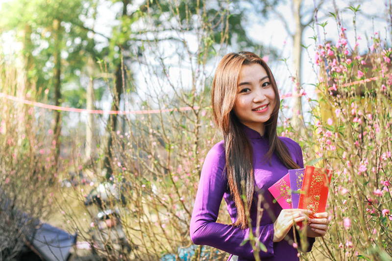

### About
This is an implementation of the 
[real time content aware resize](https://link.springer.com/article/10.1007/s11432-009-0041-9)
algorithm with Mask and Face Detection Functions.
Project consist from console application (cxinar) and library *xinar* for ```C++```, which provide resize services.

### Example
*Befoe Seam Carving*



*Seam Carving with Mask*


*Seam Carving without Mask*


### How Seam Carving Works
Seam carving (or liquid rescaling) is an algorithm for content-aware image resizing, developed by Shai Avidan, of Mitsubishi Electric Research Laboratories (MERL), and Ariel Shamir, of the Interdisciplinary Center and MERL. It functions by establishing a number of seams (paths of least importance) in an image and automatically removes seams to reduce image size or inserts seams to extend it. Seam carving also allows manually defining areas in which pixels may not be modified, and features the ability to remove whole objects from photographs.

The purpose of the algorithm is image retargeting, which is the problem of displaying images without distortion on media of various sizes (cell phones, projection screens) using document standards, like HTML, that already support dynamic changes in page layout and text but not images.

### How Mask & Face Detection Works
In the Energy Map, we will give the Masked Parts with High Energy Value.


### Dependencies and building

Xinar builds as shared library so you don't need anything to build it from sources.
But you have to have *opencv2* on your PC and *OpenCV_LIBS* linked to your application, wich uses xinar. 

To build console or graphic application from source you need
* *Qt5 core* (*only for uxinar*)
* *Qt5 widgets* (*only for uxinar*)
* *libboost-program-options* (*only for cxinar*)
* *libboost-filesystem* (*only for cxinar*)
* *libboost-system* (*only for cxinar*)
* *OpenCV 2*

Project uses CMake>=3.5 as building system.

To build project from source in your building folder type:

```
:~$ cmake <path to content-aware-resize sources>
:~$ make xinar
:~$ make uxinar
:~$ make cxinar
```

### Usage
You can use *cxinar* in two ways: as a ```C++``` library and as an application.


#### Application usage
Once you built *cxinar*, you can use it as a console application.

Console usage example:

Resize image ```examle.jpg``` using mask ```mask.jpg``` to 600 by 600 pixels:

```
:~$ ./cxinar -m mask.jpg -i example.jpg -w 600 -h 600
```

Resize image ```examle.jpg``` using built in *Face Detection Mask* to 600 by 600 pixels:

```
:~$ ./cxinar -i example.jpg -w 600 -h 600
```

All commands are available via ``` -? ``` (```--help```) flag.


**NOTE:** Xinar can resize picture up to 2 times in both height and width 
while expanding picture.

#### Library usage

```xinar::Resize``` is main class that provides resize services.
Let ```input``` and ```output``` be ```cv::Mat``` matrix objects,
 ```size``` be ```cv::Size``` object.
Then you can apply content aware resize in following way: 

```
...
#include "xinar.h"
...

int main() {
    ...

    // For single usage
    xinar::resize(cv_image, cv_output, cv_size);
    xinar::maskresize(cv_image, cv_mask, cv_output, cv_size);
    
    // For multiple usage
    xinar::Resize resizer(cv_image);
    for (auto size : cv_sizes) {
        resizer.process(cv_output, size);
        ...
    }

    ...
}

```

All documentation is available in ```docs``` folder.

### Structure

* **core** -- *seam carving algorithm implementation*
* **cui** -- *console application code*
* **filters** -- *filters functors implementation*
* **gui** -- *GUI application code*
* **include** -- *internal headers*
* **interface** -- *external headers*
* **utils** -- *various code to make life happier*

Copyright [Andery Tkachev](https://github.com/Andrey-Tkachev), 
[Nikita Orlov](https://github.com/acerikfy), Dmitriy Malygin, 2017.

